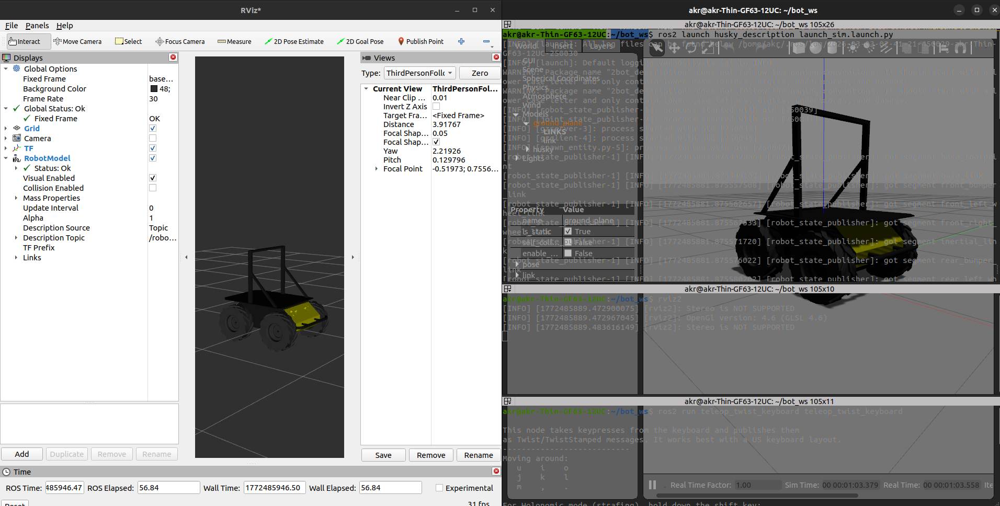

# Husky ROS 2 Description & Simulation Package



This repository contains the ROS 2 description and simulation configuration for the **Clearpath Husky** robot. It provides URDF models, mesh files, and launch configurations to simulate the Husky in Gazebo and visualize it in RViz2.

## 🚀 Features
- **Accurate URDF**: Detailed robot description using Xacro.
- **Gazebo Integration**: Pre-configured launch files for quick simulation.
- **RViz2 Support**: Visualize robot state and sensor data locally.
- **Teleoperation**: Ready-to-use keyboard control integration.

## 📋 Requirements
Before you begin, ensure you have the following installed:
- **Operating System**: Ubuntu 22.04 (Jammy Jellyfish)
- **ROS 2**: Humble Hawksbill (Recommended)
- **Gazebo**: Gazebo Classic (standard with `ros-humble-desktop`)
- **Dependencies**:
  ```bash
  sudo apt update
  sudo apt install ros-humble-gazebo-ros-pkgs ros-humble-xacro ros-humble-teleop-twist-keyboard
  ```

## 🛠️ Installation & Build
Follow these steps to clone and build the package in your workspace:

1. **Create/Navigate to your workspace**:
   ```bash
   mkdir -p ~/bot_ws/src
   cd ~/bot_ws/src
   ```

2. **Clone the repository**:
   ```bash
   # Assuming you are in ~/bot_ws/src
   git clone <repository_url> husky
   ```

3. **Install dependencies using rosdep**:
   ```bash
   cd ~/bot_ws
   rosdep install --from-paths src --ignore-src -r -y
   ```

4. **Build the package**:
   ```bash
   colcon build --symlink-install
   ```

5. **Source the workspace**:
   ```bash
   source install/setup.bash
   ```

## 🎮 How to Use

### 1. Launch the Simulation
To start Gazebo with the Husky robot spawned:
```bash
ros2 launch husky_description launch_sim.launch.py
```

### 2. Teleoperation (Control the Robot)
In a new terminal, run the teleop node to move the Husky using your keyboard:
```bash
ros2 run teleop_twist_keyboard teleop_twist_keyboard
```

### 3. Visualization in RViz2
To visualize the robot model and sensor data:
```bash
rviz2
```
*Note: You may need to add the `RobotModel` display and set the `Fixed Frame` to `odom` or `base_link`.*

## 📂 Project Structure
- `docs/`: Documentation assets (images, etc.)
- `launch/`: ROS 2 launch files.
- `meshes/`: 3D models and textures.
- `urdf/`: Xacro robot description files.

---
*Maintained by [akr](mailto:akr.workspace@gmail.com)*
